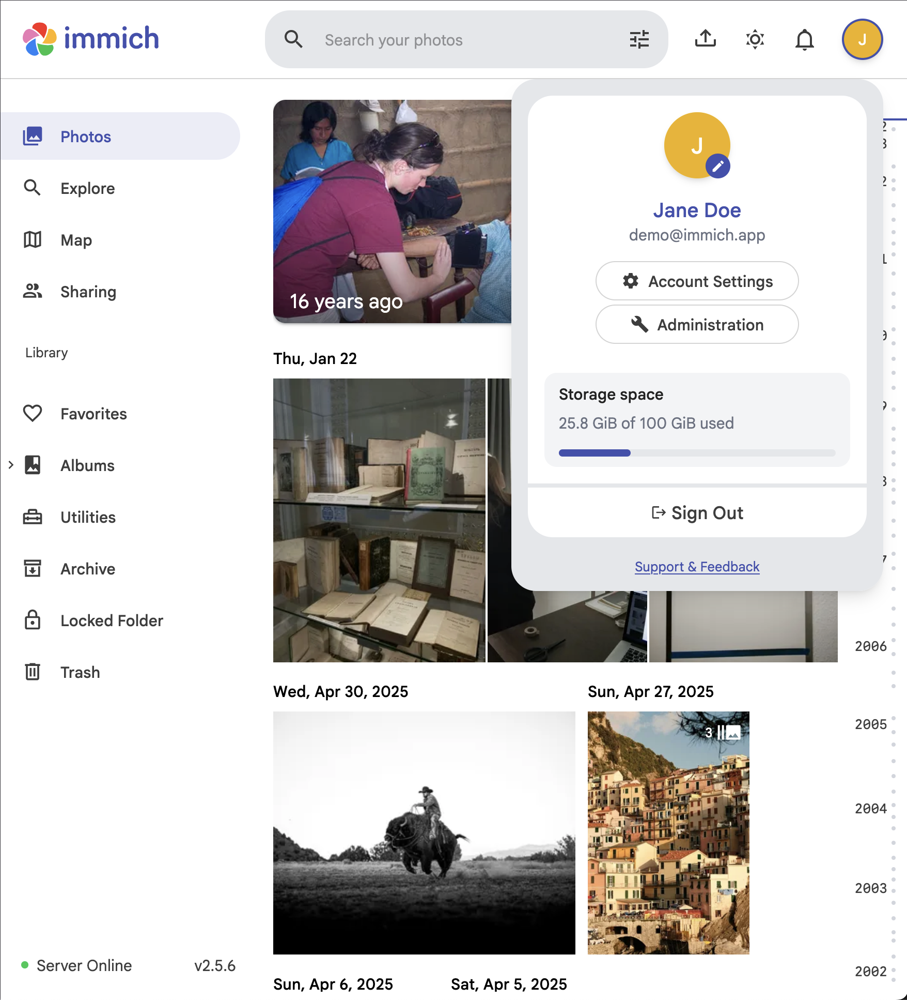
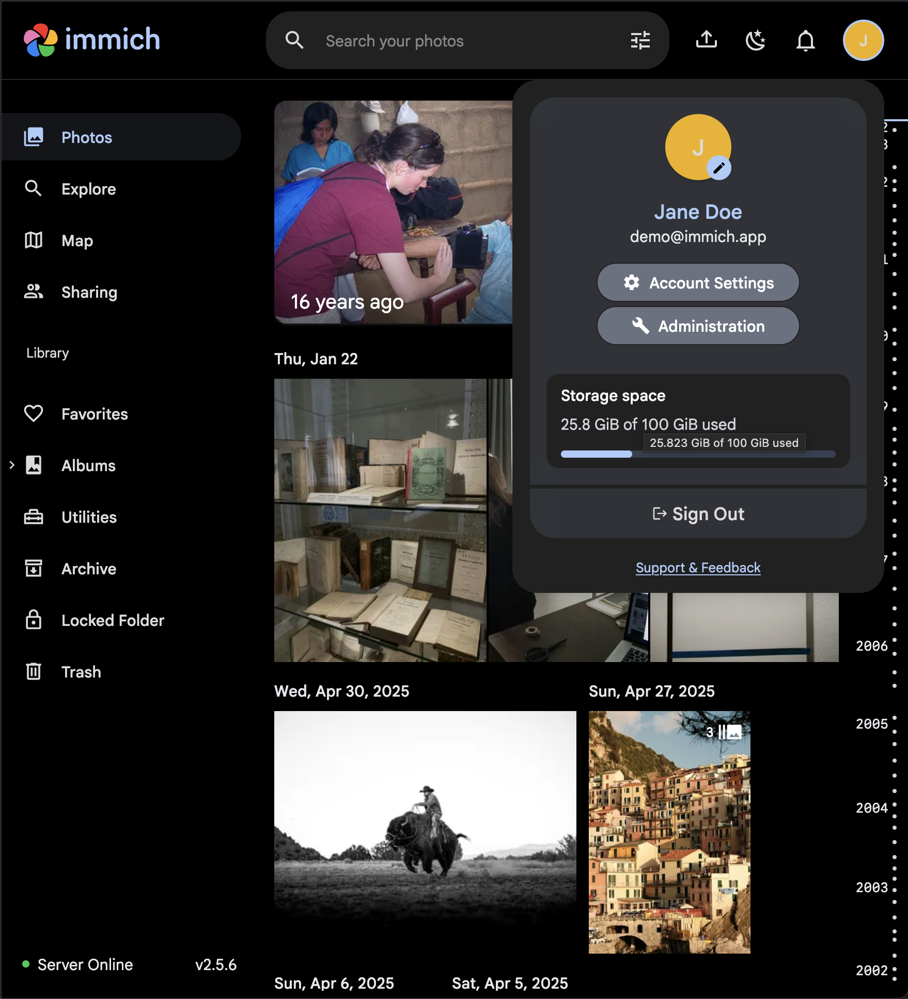

# Immich storage indicator to profile menu
This is a simple user script that hides the storage indicator from the Immich sidebar, mainly so that it doesn't become scrollable in smaller screens or if you have a lot of features enabled.
Also it adds it to the profile menu like it is in the immich app, so that it's still easily accessible.

## Installing:
If you use ViolentMonkey (or I think most script managers), clicking [this link](https://raw.githubusercontent.com/lukpeluk/immich-storage-to-profile/main/immich-storage-to-profile.user.js
) will prompt you to install it.
Also, when you install it, overwrite the matches in the script settings so it matches your immich instance URL. That's better than changing it directly in the code because it persists updates.

You can also find the script in Greasy Fork:
https://greasyfork.org/en/scripts/568307-immich-storage-indicator-to-profile-menu

